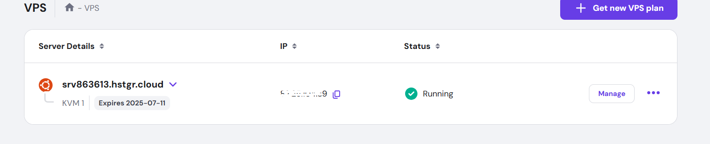
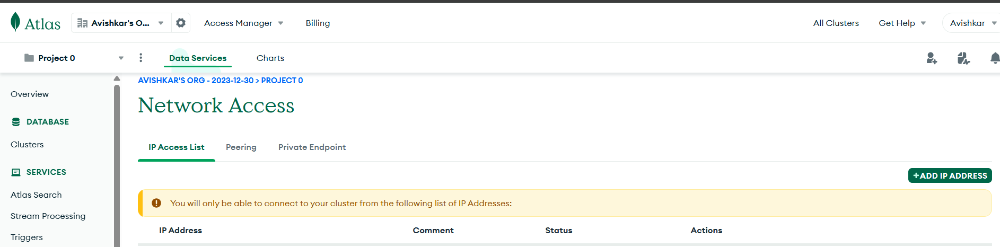
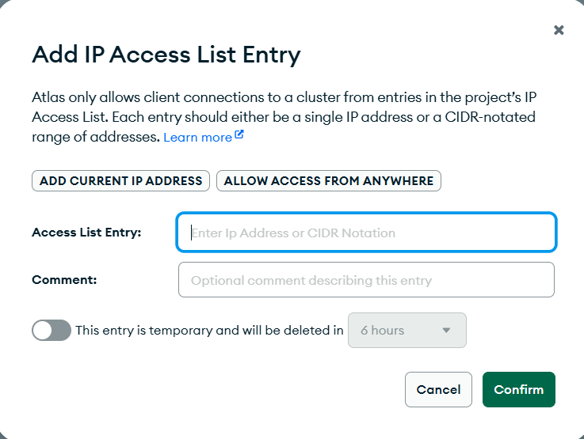

## Deploying Nodejs, MongoDB project on Hostinger vps hosting

- Prepare the vps environment
- Setup MongoDB Atlas on vps
- Deploy your node js and express app

### 1. Prepare the vps environment

#### Buy vps hosting : [Get Hosting](https://www.hostinger.com/in/vps-hosting)

#### Login into vps terminal

```
ssh root@<your_vps_ip_address>
```

- ##### hint: After pasting this command, you will have to enter password.

#### Upgrade and update your system with latest required configuration

```
sudo apt update
```

```
sudo apt upgrade -y
```

#### Install node js and npm ( if not pre-installed)

```
curl -fsSL https://deb.nodesource.com/setup_20.x | sudo bash -
```

```
sudo apt-get install -y nodejs
```

- ##### note: npm will install automatically when you'll install node js

#### install git

```
sudo apt install -y git
```

### 2. Setup MongoDB Atlas on vps

#### Go to VPS panel in hostinger

#### Copy your vps Ip address.




#### Login into mongodb atlas

#### Go to Network Access tab



#### Click on 'ADD IP ADDRESS' and paste your vps IP address (comment is optional)



### 3. Deploying the Express and Node.js Backend

#### Go to terminal
#### make directory
```
mkdir /var/www
```

#### then

```
cd /var/www
```

#### clone your git repo
```
git clone <repo_link>
```

#### Go to your repo folder inside /var/www
```
cd your_repo
```

#### install all required dependencies
```
npm install
```

#### Create .env file on vps server

```
nano .env
```

#### add environment variables then save and exit.
#### (Ctrl + X) - Exit
#### And select Y and enter

#### install pm2 to start backend service
```
npm install -g pm2
```

#### start server (in your case server file should be: server.js or main.js)

```
pm2 start app.js --name backend-project
```

#### start backend on startup and save
```
pm2 startup
```
```
pm2 save
```
